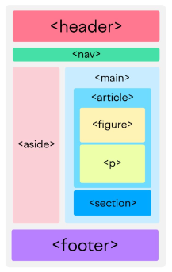

# Anotações de HTML5  

- [Aula 01 - Introdução ao Módulo](#aula-01---introdução-ao-módulo)
- [Aula 02 - O que é HTML e como usá-lo](#aula-02---o-que-é-html-e-como-usá-lo)
- [Aula 03 - Estrutura de uma página web](#aula-03---estrutura-de-uma-página-web)
- [Aula 04 - Sua primeira página HTML](#aula-04---sua-primeira-página-html)
- [Aula 05 - Elementos de Parágrafo e Título](#aula-05---elementos-de-parágrafo-e-título)
- [Aula 06 - Elementos de Formatação](#aula-06---elementos-de-formatação)
- [Aula 07 - Comentários](#aula-07---comentários)
- [Aula 08 - Quiz 1](#aula-08---quiz-1)
- [Aula 09 - Elementos de Imagem e Atributos](#aula-09---elementos-de-imagem-e-atributos)
- [Aula 10 - Formatos e Otimização de Imagem](#aula-10---formatos-e-otimização-de-imagem)
- [Aula 11 - Exercício 1: Escrevendo um artigo](#aula-11---exercício-1-escrevendo-um-artigo)
- [Aula 12 - Resolução do Exercício 1](#aula-12---resolução-do-exercício-1)
- [Aula 13 - Quebras de Linha e Régua Horizontal](#aula-13---quebras-de-linha-e-régua-horizontal)
- [Aula 14 - Organização de Código com Div e Span](#aula-14---organização-de-código-com-div-e-span)
- [Aula 15 - Trabalhando com Links](#aula-15---trabalhando-com-links)
- [Aula 16 - Entendendo URLs Absolutas e Relativas](#aula-16---entendendo-urls-absolutas-e-relativas)
- [Aula 17 - Links dentro de uma mesma página](#aula-17---links-dentro-de-uma-mesma-página)
- [Aula 18 - Links Externos](#aula-18---links-externos)
- [Aula 19 - Exercício 2: Criando um site com navegação](#aula-19---exercício-2-criando-um-site-com-navegação)
- [Aula 20 - Resolução do Exercício 2](#aula-20---resolução-do-exercício-2)
- [Aula 21 - Listas no HTML: ordenadas e não-ordenadas](#aula-21---listas-no-html-ordenadas-e-não-ordenadas)
- [Aula 22 - Quiz 2](#aula-22---quiz-2)
- [Aula 23 - Exercício 3: Lista de Álbuns](#aula-23---exercício-3-lista-de-álbuns)
- [Aula 24 - Resolução do Exercício 3](#aula-24---resolução-do-exercício-3)
- [Aula 25 - Criação de tabelas](#aula-25---criação-de-tabelas)
- [Aula 26 - Exercício 4: Tabela de Inscritos](#aula-26---exercício-4-tabela-de-inscritos)
- [Aula 27 - Resolução do Exercício 4](#aula-27---resolução-do-exercício-4)
- [Aula 28 - O que são formulários](#aula-28---o-que-são-formulários)
- [Aula 29 - Conhecendo os Tipos de Input](#aula-29---conhecendo-os-tipos-de-input)
- [Aula 30 - Elementos select e textarea](#aula-30---elementos-select-e-textarea)
- [Aula 31 - Exercício 5: Formulário de Inscrição](#aula-31---exercício-5-formulário-de-inscrição)
- [Aula 32 - Resolução do Exercício 5](#aula-32---resolução-do-exercício-5)
- [Aula 33 - Recursos modernos no HTML5](#aula-33---recursos-modernos-no-html5)
- [Aula 34 - Elementos Semânticos](#aula-34---elementos-semânticos)
- [Aula 35 - WAI-ARIA e Atributos de Acessibilidade](#aula-35---wai-aria-e-atributos-de-acessibilidade)
- [Aula 36 - Quiz 3](#aula-36---quiz-3)
- [Aula 37 - Exercício Final: Criando um Site](#aula-37---exercício-final-criando-um-site)
- [Aula 38 - Resolução do Exercício Final](#aula-38---resolução-do-exercício-final)
- [Aula 39 - Encerramento](#aula-39---encerramento)
- [Aula 40 - Prova Final com Certificado](#aula-40---prova-final-com-certificado)

----

## Aula 01 - Introdução ao Módulo

### ❗ **Nenhuma anotação** ❗

## Aula 02 - O que é HTML e como usá-lo


➡️ O que é HTML?

* **HTML** significa ***HyperText Markup Language***, ou ***Linguagem de Marcação de HiperTexto***.

* É uma linguagem usada para criar uma estrutura de elementos e suas informações , mais precisamente, os elementos de uma página web.

➡️ Como funciona?

* Funciona através de arquivos de texto com a extensão **.html**.

* Usamos o que chamamos de **tag**, que representam os elementos que queremos exibir na página web.

* Existem muitos tipos de elementos no **HTML**
  * Títulos, parágrafos, listas, tabelas, etc
  * Imagens, vídeos, áudios, etc
  * Formulários, caixas de texto, botões, etc
  * Divisores, cabeçalhos, rodapés, etc

**Exemplo de tag:**

```html
<p> Isso é uma tag </p>
```

* Uma tag pode ter **atributos**, que são características especiais de um determinado elemento.

**Exemplo de tag com atributo:**
```html
<p id="paragrafo-principal" > Isso é uma tag com atributo </p>
```

**Materiais importantes para ajudar nos estudos:**

➡️ [Documentação da MDN](https://developer.mozilla.org/pt-BR/docs/Web/HTML)

➡️ [Guias de w3schools](https://www.w3schools.com/html/html_intro.asp)

## Aula 03 - Estrutura de uma página web

* Uma págine web é composta por duas partes principais, o **head** e o **body**.

* A tag `<head>` define os meta dados do documento, ou seja, informações sobre o próprio documento.

* O `<head>` é feito **para o navegador**, para que ele "conheça melhor" a página **HTML** em questão.

* A tag `<body>` contém todo o conteúdo visível do documento.

* O `<body>` é feito **para os usuários**, ele é a página em si.

## Aula 04 - Sua primeira página HTML

* Ao criar o arquivo **HTML**, normalmente usamos **index.html** como nome padrão para a página principal porque os servidores web (como Apache e Nginx) a identificam automaticamente ao acessar o site sem especificar um arquivo. Isso facilita a navegação com URLs mais limpas (ex: www.meusite.com), melhora a organização do projeto e segue uma convenção histórica amplamente adotada no desenvolvimento web.

* Existe uma forma mais fácil e rápida de escrever a estrutura primária do **HTML** que é digitando um **ponto de exclamação** ou escrever **"html"** na primeira linha.

**Estrutura que será feita:**

```html
<!DOCTYPE html>
<html lang="en">
<head>
    <meta charset="UTF-8">
    <meta name="viewport" content="width=device-width, initial-scale=1.0">
    <title>Document</title>
</head>
<body>
    
</body>
</html>
```

* Nessa estrutura, de início mudamos algumas informações: 
    * **Primeiro** mudamos a tag `<html lang="en">` para `<html lang="pt-br">`, pois é através dessa tag que definimos o idioma principal do conteúdo da página.
    * **Depois** mudamos a tag `<title>`, que define o título ou nome do documento.

---
**Usando a extensão Live Server no VS Code:**

➡️ Basta clicar com o botão direito em cima do arquivo **HTML** que deseja iniciar e clicar em **"Open with Live Server"**, que irá iniciar o server local e abrir o navegador com a página **HTML**.

➡️ Ao ser iniciado, aparece uma notificação informando em qual porta o servidor foi iniciado.

➡️ Podemos usar o caminho "localhost:", colocando a porta do server após os dois pontos, na barra de navegação do navegador e irá redirecionar para o server com a página **HTML**.

## Aula 05 - Elementos de Parágrafo e Título

* Os **elementos de título** são representados pelo **heading**, usando as tags `<h1>` ao `<h6>`, onde o `<h1>` é o nível mais alto e o `<h6>` é o nível mais baixo.  

* A tag `<p>` representa um parágrafo.

## Aula 06 - Elementos de Formatação

* Para escrever em **negrito**, usamos a tag `<b>` **(bold)**

```html
Uso em <b>negrito</b>
```

* Para escrever em *itálico*, usamos a tag `<i>` **(italic)**

```html
Uso em <i>itálico</i>
```

* Também é possível usar os dois tipos de formatação em um texto só

```html
Uso em <b><i>ambos</i></b>
```

**Importante:**

➡️ **Negrito** e **Itálico** são elementos de estilização, ou seja, é pouco comum utilizar essas tags, pois estilização é feita no **CSS**.

➡️ Existem duas tags semânticas que são usadas para trazer estilização e significado ao texto:

✴️ `<strong>` ➜ deixa o texto em **negrito**, significa que tem um texto de **grande importância**.

✴️ `<em>` ➜ vem da palavra **"emphasis"**, significa **ênfase**, essa tag deixa em itálico.

## Aula 07 - Comentários

* Para fazer um comentário, basta escrever o comentário dentro da estrutura `<!-- -->`

```html
<!-- Este texto não será exibido no site pois é um comentário -->
```

## Aula 08 - Quiz 1

### ❗ **Quiz realizado na plataforma** ❗

## Aula 09 - Elementos de Imagem e Atributos

* Para colocar uma **imagem** na página **HTML**, usa-se aa tag ``

```html

```

✴️  **"src"** ➜ source / fonte

✴️ **"./imagens/exemplo.png"** ➜ é a URL, o caminho do arquivo da imagem.

**Existem também alguns outros atributos que podem ser atribuídos na tag ``:**

```html

```

✴️ **src** ➜ **Necessário**, arquivo da imagem (URL / Path).

✴️  **loading** ➜ Como o navegador deve carregar a imagem.

✴️ **alt** ➜ Descrição da imagem.

✴️  **width** ➜ Largura da imagem.

✴️  **height** ➜ Altura da imagem.

## Aula 10 - Formatos e Otimização de Imagem

* É sempre importante que uma página web esteja sempre otimizada. Páginas pesadas demoram a carregar e consomem mais dados, o que é ruim pra quem tem dados limitados, gerando uma experiência ruim.
* Um dos aspectos que mais podem atrapalhar uma página web são suas imagens.

**Como otimizar as imagens?**

➡️ Utilize os formatos corretos de imagem:

✴️ **️JPEG:** ➜ Formato de **maior qualidade**, porém **mais pesado**.

✴️ **PNG:** ➜ Formato **inferior ao JPEG**, mas que **pode ser comprimido mantendo a qualidade**.

✴️ **WEBP:** ➜ Formato criado especificamente para a web pelo **Google**, oferece o **melhor equilibrio entre qualidade e tamanho reduzido**.

✴️ **SVG:** ➜ Formato usado para **vetores**, que são imagens geométricas **super leves** e que **podem escalar para qualquer tamanho**.

➜ Utilize os tamanhos corretos de imagem:

✴️ Imagens grandes ficam pesadas e imagens pequenas ficam pixeladas.

✴️ Para definir diferentes versões da imagem para diferentes dispositivos basta usar o artibuto **"scrset"**.

➜ Comprima a imagem, se possível.

## Aula 11 - Exercício 1: Escrevendo um artigo

### ❗ [**Exercício Resolvido**](../HTML5/Exercicios/Exercicio-01/Minha-Resolucao/) ❗ 

## Aula 12 - Resolução do Exercício 1

### ❗ [**Resolução**](../HTML5/Exercicios/Exercicio-01/Resolucao-do-Exercicio/) ❗

## Aula 13 - Quebras de Linha e Régua Horizontal

✴️ `<br>` ➜ Vem da palavra **"break"**, quebra de linha.

✴️ `<hr>` ➜ Abreviação de **"horizontal rule"**, faz uma linha horizontal (régua horizontal) na página.

## Aula 14 - Organização de Código com Div e Span

* No **HTML** temos dois elementos genéricos para ajudar na organização da página, o `<div>` e o `<span>`: 

✴️ `<div>` ➜ Organiza o conteúdo em blocos, quebra a linha ohnde é inserido e ocupa toda a largura horzontal disponível.

✴️ `<span>` ➜ Organiza o conteúdo em linha, não quebra a linha onde é inserido e segue o fluxo normal de texto. 

## Aula 15 - Trabalhando com Links

* Para criar um **link**, é usado a tag `<a>`, que é uma tag **âncora**.

```html
<a href="./index.html">Página Principal</a>
```

✴️  **"href"** ➜ É a **URL** para onde o hyperlink direciona

## Aula 16 - Entendendo URLs Absolutas e Relativas


* **"Raiz"** ou **"Diretório Raiz"** o caminho inicial do site. A **raiz** é a página onde caímos quando não especificamos nenhum caminho **URL**, apenas o **endereço base**.

```html
<p> Navegue entre as guias
    <a href="./index.html">Página Principal</a>
    <a href="./guia1.html">Guia 1</a>
    <a href="./guia2.html">Guia 2</a>
</p>
```

✴️  **"./index.html"** ➜ Endereço base, "nome do arquivo"

* Como se trata de um caminho dentro do próprio site, é possível ocultar o endereço base e usar apenas **"/"** para designar a raiz do site.

| URL Absoluta | URL Relativa |
| :---: | :---: |
| - Caminho completo de uma URL/determinada página | É um caminho relativo à página atual |
| `<a href="https://www.google.com">Google</a>` | `<a href="//exemplo.html"></a>` |
|---| - Se o arquivo que contém esse link estiver na mesma pasta, o navegador irá procurar o arquivo na mesma pasta |

**Dicas:**

✴️ `../index.html` ➜ `../` a partir do nível anterior da pasta.

✴️ `./index.html` ➜ `./` a partir da **pasta atual**.

✴️ `/index.html` ➜ `/` a partir da **pasta raiz**.

✴️ `index.html` ➜ **Arquivo atual**.

**Exemplos:**

```
  📂 Diretório-raiz 
  ├ 📂 Nivel-1
  │ │  📄 nivel-1.html
  │ └📂 Nivel-2
  │    📄 nivel-2.html
  index.html
```

✴️ Caminho para acessar o **"nivel-2.html"** a partir do **"nivel-1.html"** ➜ `../nivel-2/nivel-2.html`.

✴️ Caminho para acessar o arquivo a partir da página atual ➜ `./nivel-1.html`.

✴️ Caminho a partir do diretório raiz ➜ `/index.html`.

✴️ Caminho do arquivo atual ➜ `nivel-2.html`.

## Aula 17 - Links dentro de uma mesma página

* Para criar um link pra dentro de uma página, primeiro é necessário criar um **"id"** para o elemento destino.
* Ao definir o caminho do link, utilizar **"#"** seguido do **"id"** do elemento.

```html
<div>
    <p>Navegue entre as seções dessa página:</p>
    <a href="#titulo-1">Título 1</a>
    <a href="#titulo-2">Título 2</a>
</div>

<div>
	<h2 id="titulo-1">Título 1</h2>
	<p>Lorem, ipsum dolor sit amet consectetur adipisicing elit.</p>	
	<h2 id="titulo-2">Título 2</h2>
	<p>Lorem, ipsum dolor sit amet consectetur adipisicing elit.
</div>
```

## Aula 18 - Links Externos

* Para **links externos**, é necessário incluir o **protocolo** no início da **URL**, caso contrário, o navegador pode tratar o link como um **link relativo** e resultar em **erro**.

| **ERRADO** | **CERTO** |
| :---: | :---: |
| `href="www.google.com"` |`href="https://www.google.com"` ou `href="//google.com"`|
| --- | É possível usar o **protocolo relativo**, onde a **URL** começa com `//`, significando que o link usa o mesmo protocolo que a página atual.<br><br> `Exemplo:` Se a página atual estiver carregada em HTTPS, o navegador também usará HTTPS para abrir o link. |

* Quando usado um link para sites externos, é interessante que os abra em novas janelas.

* A tag `<target>` é usada para especificar onde o documento vinculado será aberto.

```html
<a href="https://google.com" target="_self">Google</a>

<a href="https://google.com" target="_blank">Google</a>

<a href="https://google.com" target="_parent">Google</a>

<a href="https://google.com" target="_top">Google</a>
```

✴️ `target="_self"` padrão ➜ Abre o link na **mesma página** onde foi clicado.

✴️ `target="_blank"` ➜ Abre o link em uma **nova aba ou janela**.

✴️ `target="_parent"` ➜ Abre o link na **janela ou quadro pai (frame / iframe) do atual**. Se a página não estiver dentro de um frame, este valor se comporta como `_self`. 

✴️ `target="_top"` ➜ Abre o link mais externo possível, ou seja, na janela inteira, removendo todos os frames. É útil para garantir que o link carregue na página principal, ignorando qualquer contexto de frame / iframe. Se a página não estiver dentro de um frame, este valor se comporta como `_self`. 

## Aula 19 - Exercício 2: Criando um site com navegação

### ❗ [**Exercício Resolvido**](../HTML5/Exercicios/Exercicio-02/Minha-Resolucao/) ❗

## Aula 20 - Resolução do Exercício 2

### ❗ [**Resolução**](../HTML5/Exercicios/Exercicio-02/Resolucao-do-Exercicio/) ❗

## Aula 21 - Listas no HTML: ordenadas e não-ordenadas

* Existem duas formas de listas:

**Lista Ordenada**

```html
<ol>
	<li>item 1</li>
	<li>item 2</li>
	<li>item 3</li>
</ol>
```

**Lista Não-Ordenada**

```html
<ul>
	<li>item 1</li>
	<li>item 2</li>
	<li>item 3</li>
</ul>
```

✴️ `Lista Ordenada` ou `Ordered List` ➜ É um ista organizada de forma numérica. É representada pela tag `<ol>`.

✴️ `Lista Não-Ordenada` ou `Unordered List ` ➜ É uma lista organizada por pontos, ou seja, sem ordem. É representada pela tag `<ul>`.

* Cada item de uma lista é representada pela tag `<li>`. 

**Dica de VS Code:**

* Para criar um novo documento dentro de uma pasta de forma mais fácil, é só colocar antes do arquivo o nome da pasta a ser criada: `nova-pasta/index.html`.

## Aula 22 - Quiz 2

### ❗ **Quiz realizado na plataforma** ❗

## Aula 23 - Exercício 3: Lista de Álbuns

### ❗ [**Exercício Resolvido**](../HTML5/Exercicios/Exercicio-03/Minha-Resolucao/) ❗

## Aula 24 - Resolução do Exercício 3

### ❗ [**Resolução**](../HTML5/Exercicios/Exercicio-03/Resolucao-do-Exercicio/) ❗

## Aula 25 - Criação de tabelas

* As tabelas permitem organizar dados em linhas e colunas.
* Para criar uma tabela, usamos a tag `<table>`.
* Dentro da tabela, para criar uma **linha nova** é usada a tag `<tr>` **(table row)** e para criar **novas células / dados** é usado `<td>` **(table data)**.
* Para definir uma **célula header** para a tabela é usado `<th>` **(table header)**.
* Para definir um **head** para a tabela é usado `<thead>` **(table head)**.
* Para definir um **body** para a tabela é usado `<tbody>` **(table body)**.

```html
<table>
    <thead>
      	<tr>
        	<td>Coluna 1</td>
        	<td>Coluna 2</td>
        	<td>Coluna 3</td>
      	</tr>
    </thead>
    <tbody>
      	<tr>
        	<td>Dado 1</td>
        	<td>Dado 2</td>
        	<td>Dado 3</td>
      	</tr>
    </tbody>
</table>
```

* É possível usar os atributos **"colspan"** e **"rowspan"** para manipular quantas células ou colunas a tag irá ocupar.

```html
<table>
    <thead>
      	<tr>
        	<td colspan="2">Informações Pessoais</td>
        	<td>Telefone</td>
      	</tr>
    </thead>
    <tbody>
      	<tr>
        	<td>Dado 1</td>
        	<td rowspan="2">(21) 91234-5678</td>
      	</tr>
    </tbody>
</table>
```

## Aula 26 - Exercício 4: Tabela de Inscritos

### ❗ [**Exercício Resolvido**](../HTML5/Exercicios/Exercicio-04/Minha-Resolucao/) ❗

## Aula 27 - Resolução do Exercício 4

### ❗ [**Resolução**](../HTML5/Exercicios/Exercicio-04/Resolucao-do-Exercicio/) ❗

## Aula 28 - O que são formulários

* **Formulários** são estruturas que permitem a coleta de informações dos usuários, como nome, e-mail, senha, entre outros.
* As estruturas são compostas por elementos que possibilitam a criação de campos de entrada, botôes de envio e outras funcionalidades interativas.
* Os **forms** são compostos por:

✴️ Uma tag `<form>` com os atributos **"action"** e **"method"**.

✴️ Campos a serem preenchidos, como `<input>` ou `<select>`.

✴️ Um **botão** para o formulário.

```html
<form action="https://google.com/search" method="get">
    <label for="pesquisar">Pesquise o nome no google</label>
    <input type="text" name="q" id="pesquisar">
    <button tupe="submit">Pesquisar</button>
</form>  
```

✴️ `action=" "` ➜ Ação na qual queremos realizar.

✴️ `method=" "` ➜ Método a usar.

✴️ `<label>` ➜ Cria um rótulo para o input.

✴️ `for=" "` ➜ Identifica (ID) o input que o `<label>` vai rotular.

✴️ `name=" "` ➜ Identificação do campo de acordo com o back-end (nesse caso usamos "q", que vem de query, pois é como o google identifica no seu back-end).

* Para fazer com que um campo seja obrigatório, é só inserir a instrução **"required"**.

```html
<form>
    <label for="nome">Nome:</label>
    <input type="text" id="nome" name="nome" required>
</form>
```

## Aula 29 - Conhecendo os Tipos de Input

* Existem muitos tipos de **input**, a melhor forma de identificar é pesquisando, mas alguns são:

✴️ `<input type="text">` ➜ Inserir texto.

✴️ `<input type="email">` ➜ Inserir e-mail.

✴️ `<input type="password">` ➜ Inserir senha.

✴️ `<input type="number">` ➜ Campo numérico.

✴️ `<input type="radio">` ➜ Campo de escolha única (ex: gênero).

✴️ `<input type="checkbox">` ➜ Campo de escolha múltipla, podendo selecionar ou deselecionar.

✴️ `<input type="date">` ➜ Campo de data.

✴️ `<input type="file">` ➜ Campo de envio de arquivos.

## Aula 30 - Elementos select e textarea

✴️ `<select>` ➜ Elemento de **seleção** a partir da lista de opções definidas que surgem abaixo da caixa.

✴️ `<textarea>` ➜ Elemento que permite a **inserção** de um texto em múltiplas linhas.

```html
<form>
    <label for="opcao">Escolha:</label>
    <select name="opcao" id="opcao">
      	<option value="opcao-1" selected disabled>Opção 1</option>
     	<option value="opcao-2">Opção 2</option>
      	<option value="opcao-3">Opção 3</option>
    </select>

    <label for="sobre">Sobre mim:</label>
    <textarea name="sobre" id="sobre" cols="40" rows="6" placeholder="Escreva sobre você"></textarea>

    <button type="submit">Enviar</button>
</form>
```

✴️ `<option>` ➜ Define as opções.

✴️ `value` ➜ Valor que vai ser informado ao back-end.

✴️ `selected` ➜ Atributo que faz com force a opção ser selecionada.

✴️ `disabled` ➜ Atributo que desativa a seleção da opção.

✴️ `cols=" "` ➜ Define o número de colunas da caixa de texto.

✴️ `rows=" "` ➜ Define o número de linhas da caixa de texto.

✴️ `placeholder=" "` ➜ Define um texto informativo dentro da caixa de texto, não influencia no texto que o usuário vai inserir.

## Aula 31 - Exercício 5: Formulário de Inscrição

### ❗ [**Exercício Resolvido**](../HTML5/Exercicios/Exercicio-05/Minha-Resolucao/) ❗

## Aula 32 - Resolução do Exercício 5

### ❗ [**Resolução**](../HTML5/Exercicios/Exercicio-05/Resolucao-do-Exercicio/) ❗

## Aula 33 - Recursos modernos no HTML5

* **Links Úteis**

➡️ [Tag de vídeo HTML5](https://www.w3schools.com/html/html5_video.asp)

➡️ [Tag de áudio HTML5](https://www.w3schools.com/html/html5_audio.asp)

➡️ [Semantica no HTML5](https://www.w3schools.com/html/html5_semantic_elements.asp)

➡️ [Documentação dos tipos de input](https://www.w3schools.com/html/html_form_input_types.asp)

➡️ [Simulando os tipos novos de input](https://www.webfx.com/blog/images/assets/cdn.sixrevisions.com/demos/0345-new_html5_form_input_types/new-html5-form-input-types.html)


## Aula 34 - Elementos Semânticos



✴️ `<header>` ➜ Define o cabeçalho.

✴️ `<nav>` ➜ Define uma seção de navegação.

✴️ `<main>` ➜ Define o conteúdo principal da página.

✴️ `<section>` ➜ Define uma seção temática da página.

✴️ `<article>` ➜ Define um conteúdo independente e completo dentro de uma página.

✴️ `<aside>` ➜ Define um conteúdo relacionado que pode ser considerado como um **"sidebar"** ou uma informação complementar.

✴️ `<footer>` ➜ Define o rodapé da página.

✴️ `<address>` ➜ Define informações de contato.

## Aula 35 - WAI-ARIA e Atributos de Acessibilidade

* Os quatro pilares da acessibilidade segundo a WCAG **(Web Content Acessibility Guidelines)**:

➡️ **Perceptível** ➜ Garantir que os conteúdos sejam apresentados de maneira clara e adaptável, permitindo a personalização. **(Conteúdos alternativos, apresentação personalizável, contraste na apresentação)**.

➡️ **Operável** ➜ Facilitar a interação e a navegação, tornando a web utilizável por diversos dispositivos e tecnologias assistivas. **(Uso através do teclado, facilitar localização e navegação)**.

➡️ **Compreensível** ➜ Tornar a informação e o funcionamento dos elementos claros e fáceis de entender. **(Textos legíveis e compreensíveis, correção e prevenção de erros)**.

➡️ **Robusto** ➜ Criar conteúdos que possam ser interpretados de forma consistente por uma variedade de agentes do usuário. **(Zelar pela compatibilidade)**.

* **WAI-ARIA** significa ***Web Accessibility Initiative - Accessible Rich Internet Applications***.

* Tem como objetivo estender as capacidades dos elementos HTML para torná-los mais acessíveis e interativos.

* Adiciona o suporte a tecnologias assistivas, como leitores de tela, por meio de atributos ARIA.

**Alguns exemplos práticos:**

✴️ Tornar as imagens acessíveis adicionando um texto alternativo (atributo "alt") para descrever a imagem.

✴️ Usar corretamente os títulos (h1, h2, h3, etc) para estruturar o conteúdo e facilitar a navegação para leitores de tela.

✴️ Criar formulários acessíveis usando rótulos (elemento "label") associados aos inputs do formulário.

✴️ Usar cores para garantir contraste suficiente e permitir a distinção de elementos por usuários com deficiência visual.

✴️ Tornar links e botões claros e descritivos para facilitar a compreensão do conteúdo e não usar ícones sem um rótulo.

✴️ Utilização dos atributos "label", "role", "state" e "property" do WAI-ARIA para melhorar a semântica e comportamento de elementos.

**Exemplo:**

```html
<div role="alert" aria-labelledby="infoHeading" aria-describedby="infoContent">
    <h2 id="infoHeading">Informação Importante</h2>
    <p id="infoContent">Esta é uma mensagem informativa para os usuários.</p>
</div>
```

✴️ `role=" "` ➜ Define o propósito ou valor semântico de um elemento na interface de usuário. O uso de `role` ajuda a tornar componentes interativos e elementos personalizados acessíveis para pessoas com deficiência.

| `role = " "` | Função |
| :---: | :---: |
| `alert` | Um alerta importante que requer a atenção imediata do usuário. |
| `button` | Indica que o elemento age como um botão. |
| `navigation` | Define uma área de navegação. |
| `menu` | Define uma lista de opções ou comandos. |
| `dialog` | Representa uma caixa de diálogo ou modal. |


✴️ `aria-labelledby=" "` ➜ Identifica o elemento que rotula o elemento atual.  

✴️ `aria-describedby=" "` ➜ Identifica o elemento que descreve o objeto. 


## Aula 36 - Quiz 3

### ❗ **Quiz realizado na plataforma** ❗

## Aula 37 - Exercício Final: Criando um Site

### ❗ [**Exercício Resolvido**](../HTML5/Exercicio-Final/Minha-Resolucao/) ❗

## Aula 38 - Resolução do Exercício Final

### ❗ [**Resolução**](../HTML5/Exercicio-Final/Resolucao-do-Exercicio/) ❗

## Aula 39 - Encerramento

### ❗ **Nenhuma anotação** ❗

## Aula 40 - Prova Final com Certificado