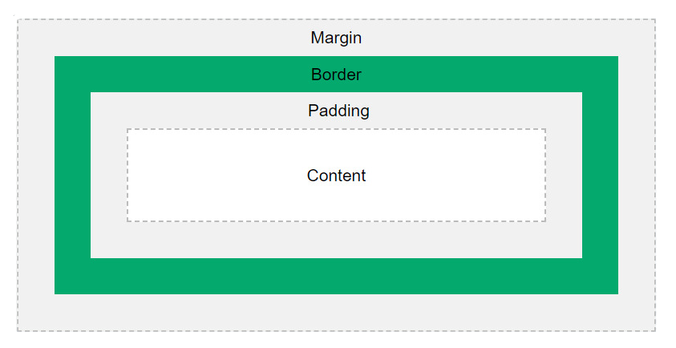
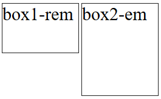

# Anotações de CSS3  
 
  - [Aula 01 - Introdução ao Módulo](#aula-01---introdução-ao-módulo)
  - [Aula 02 - O que é CSS e como usá-lo](#aula-02---o-que-é-css-e-como-usá-lo)
  - [Aula 03 - Seu primeiro código CSS](#aula-03---seu-primeiro-código-css)
  - [Aula 04 - DevTools para CSS](#aula-04---devtools-para-css)
  - [Aula 05 - Cores](#aula-05---cores)
  - [Aula 06 - Background e Border](#aula-06---background-e-border)
  - [Aula 07 - Exercício 1](#aula-07---exercício-1)
  - [Aula 08 - Resolução do Exercício 1](#aula-08---resolução-do-exercício-1)
  - [Aula 09 - Box Model: margin e padding](#aula-09---box-model-margin-e-padding)
  - [Aula 10 - Display: none, inline, block e inline-b](#aula-10---display-none-inline-block-e-inline-b)
  - [Aula 11 - Seletores Básicos](#aula-11---seletores-básicos)
  - [Aula 12 - Exercício 2](#aula-12---exercício-2)
  - [Aula 13 - Resolução do Exercício 2](#aula-13---resolução-do-exercício-2)
  - [Aula 14 - Textos e Fontes](#aula-14---textos-e-fontes)
  - [Aula 15 - Usando o Google Fonts](#aula-15---usando-o-google-fonts)
  - [Aula 16 - Unidades de Medida](#aula-16---unidades-de-medida)
  - [Aula 17 - Exercício 3](#aula-17---exercício-3)
  - [Aula 18 - Resolução do Exercício 3](#aula-18---resolução-do-exercício-3)
  - [Aula 19 - Herança](#aula-19---herança)
  - [Aula 20 - Especificidade](#aula-20---especificidade)
  - [Aula 21 - Seletores Avançados](#aula-21---seletores-avançados)
  - [Aula 22 - Variáveis](#aula-22---variáveis)
  - [Aula 23 - Projeto Prático: Site Completo com HTML e CSS - Parte 1](#aula-23---projeto-prático-site-completo-com-html-e-css---parte-1)
  - [Aula 24 - Projeto Prático: Site Completo com HTML e CSS - Parte 2](#aula-24---projeto-prático-site-completo-com-html-e-css---parte-2)
  - [Aula 25 - Exercício Extra](#aula-25---exercício-extra)
  - [Aula 26 - Resolução do Exercício Extra - Parte 1](#aula-26---resolução-do-exercício-extra---parte-1)
  - [Aula 27 - Resolução do Exercício Extra - Parte 2](#aula-27---resolução-do-exercício-extra---parte-2)
  - [Aula 28 - Resolução do Exercício Extra - Parte 3](#aula-28---resolução-do-exercício-extra---parte-3)
  - [Aula 29 - Encerramento](#aula-29---encerramento)
  - [Aula 30 - Prova Final com Certificado](#aula-30---prova-final-com-certificado)

----

## Aula 01 - Introdução ao Módulo

❗ Nenhuma anotação ❗

## Aula 02 - O que é CSS e como usá-lo

* **CSS** significa ***Cascading Style Sheets***, ou ***Folhas de Estilo em Cascata***.

* Linguagem usada para definir os estilos de um documento **HTML**.

* Ela ser uma linguagem de **folhas de estilo em cascata**, significa que as estilizações são feitas em cascatas, ou seja, são lidas de cima pra baixo, sendo assim, uma estilização sobrepõe a outra.

```css
h1 {
    color: black;
    color: red;
}
```

✴️ A cor que vai prevalecer é a vermelha, pois é o estilo que vem depois, ou seja, sobrepõe o estilo anterior.

* O **CSS** pode ser incluído de **três formas diferentes**:


**Com o atributo style**
```html
<h1 style="color: red;">Título Vermelho</h1>
```

**Com a tag style**

```html
<head>
    <style>h1 {color: red;}</style>
</head>
```

**Com a tag apontando para um arquivo CSS**

```html
<link rel="stylesheet" href="style.css">
```

➡️ A forma mais correta de se usar é **usar uma tag apontando para um arquivo css**, pois é uma maneira de manter seu código organizado, visto que normalmente são escritas muitas linhas de código.

### Estrutura de um código CSS

```css
h1 {
    color: red;
}
```

✴️ `h1` ➜ É o **seletor**, ou seja, o termo que seleciona qual parte do documento terá esse estilo.

✴️ `{ }` ➜ Delimitam o **bloco de declarações**, ou seja, onde começam e terminam os estilos a serem aplicados no(s) elemento(s) selecionado(s).

✴️ `color: red;` ➜ Define um estilo. Declarações são sempre compostas por duas partes, a **propriedade** e o **valor**, separadas por vírgula, e finalizadas por ponto e vírgula.

**Exemplo:**

```css
seletor {
    propriedade: valor;
    outra-propriedade: valor;
}
```

## Aula 03 - Seu primeiro código CSS

* O atributo `style=" "` usamos dentro de uma tag.
* A tag `<style>` usamos dentro do `<head>` da página.
* A tag `<link>` usamos dentro do `<head>` da página.

### index.html
```html
<!DOCTYPE html>
<html lang="pt-br">
<head>
    <meta charset="UTF-8">
    <meta name="viewport" content="width=device-width, initial-scale=1.0">
    <title>Seu primeiro código CSS</title>

    <!-- Tag style -->
    <style>
        h1 {
            color: white;
        }
    </style>

    <!-- Link direcionando para o arquivo CSS -->
    <link rel="stylesheet" href="style.css">

</head>
<body style="background-color: black;"> <!-- Atributo inline -->
    <h1>Seu Primeiro Código CSS</h1>
    <p>Lorem ipsum dolor sit amet consectetur adipisicing elit.</p>
</body>
</html>
```

➡️ Na tag link, `rel=" "` é a relação do documento linkado com o documento atual e `href=" "` é o caminho do arquivo que vai ser linkado.

* Ao criar o arquivo **CSS**, normalmente usamos **style.css** como nome padrão para a folha de estilos principal, pois é um nome descritivo e direto, amplamente reconhecido e adotado na organização de projetos web. Esse nome facilita a identificação do conteúdo do arquivo, indicando claramente que ele define os estilos do site, e segue uma convenção popular tanto entre desenvolvedores quanto em sistemas de gerenciamento de conteúdo.

## Aula 04 - DevTools para CSS

* Para abrir o DevTools, basta clicar com o botão direito do mouse dentro da página web desejada e clicar em **"inspecionar"**.

## Aula 05 - Cores

* No **CSS** podemos trabalhas com cores em vários formatos:

| **Nome** das Cores| **Código** das Cores |
| :---: | :---: |
| **Não recomendado,** pois não há uma garantia de padronização das cores | **Forma recomendada**, pois especifica a cor exata a ser usada de forma precisa |

### Código de Cores

✳ **RGB**

* **RGB** significa **"Red Green Blue"**.
* Utiliza a função `rgb( )` do **CSS** para processar uma cor a partir dos valores de **vermelho (R)**, **verde (G)** e **azul (B)**. Cada valor pode ir de 0 até 255.

```css
h1 {
    color: rgb(255, 0, 0);
}
```

✳ **Hexadecimais**

* Utiliza a numeração hexadecimal para especificar cores no formato **RGB** de forma abreviada.
* O formato usado é `#RRGGBB`, e os valores são convertidos de hexadecimal para decimal.
* Números hexadecimais representam os valores decimais de 0 a 15, porém usando os algarismos 0, 1, 2, 3, 4, 5, 6, 7, 8, 9, A, B, C, E e F.

```css
h1 {
    color: #FF0000;
}
```

✴️ Onde: `FF = 255` | `00 = 0` | `00 = 0`

✳ **HSL**

* Um formato diferente, porém muito útil para a manipulação de cores.
* Utiliza o esquema de **tonalidade (Hue)**, **saturação (Saturation)** e **brilho (Lightness)**.
* Assim como no rgb, o **CSS** também possui uma função `hsl( )`.

```css
h1 {
    color: hsl(0, 100%, 50%)
}
```

**Dica:** Use uma ferramenta de **seletor de cores** ou ***color picker***.

## Aula 06 - Background e Border

✴️ `background-color: ` ➜ Define a **cor** de fundo.

```css
body {
    background-color: rgb(255, 0, 0);
    background-color: #1e1e1e;
    background-color: hsl(0, 100, 50);
}
```

✴️ `background-image: ` ➜ Define a **imagem** de fundo.

✴️ `background-size: ` ➜ Define o tamanho da imagem de fundo.

✴️ `background-repeat: ` ➜ Define como uma imagem de fundo é repetida dentro de um elemento.

* Existem 3 tamanhos padrões e mais comuns além de poder definir um tamanho específico:
    * `auto` ➜ Mantém o tamanho original da imagem. A imagem não será redimensionada automaticamente para se ajustar ao elemento e repetirá. 
    * `contain` ➜ Redimensiona a imagem para que ela fique completamente visível dentro do elemento, mantendo sua proporção. A imagem será ajustada até que uma de suas dimensões (largura ou altura) caiba no elemento.
    * `cover` ➜ Redimensiona a imagem de fundo para cobrir completamente o elemento, mantendo sua proporção original. A imagem pode ser cortada para se ajustar às dimensões do elemento.

```css
body {
    background-image: url(https://exemplo.com/imagem.png);
    background-size: cover;
    background-repeat: repeat-y;
}
```

✴️ `border-width: ` ➜ Define a **largura** da borda de todos os **quatro lados**.

✴️ `border-color: ` ➜ Define a **cor** da borda.

✴️ `border-style: ` ➜ Define o **estilo** da borda.


```css
div {
    border-width: 4px;
    border-color: #1c1a1d;
    border-style: solid;
}
```

✴️ `border: ` ➜ Define a largura, o estilo e a cor da borda ao mesmo tempo.

```css
div {
    border: 4px solid #1e1e1e;
}
```

✴️ `height: ` ➜ Define a **altura** do elemento.

✴️ `width: ` ➜ Define a **largura** do elemento.

```css
div {
    background-color: #ffffff;
    border: 4px solid #1e1e1e;
    height: 64px; 
    width: 320px;
} 
```

✴️ `background-image: gradient` ➜ `Gradient` é um elemento que vai de uma cor para outra gradualmente. Existem vários tipos de gradiente. 

✴️ `border-top: ` ➜ Define o estilo da borda de cima.

```css
div {
    background-image: linear-gradient(45deg, #2c2c2d, #f64348);
    border-top: 4px dotted #1c1a1d;
    height: 64px;
    width: 320px;
}
```
    
✴️ `border-radius: ` ➜ Define o arredontamento das bordas.
* Caso queira definir um lado específico, basta especificar: **ex: border-top-right-radius**.

```css
div{
    background-color: #0077ff;
    border: 2px solid #1c1a1d;
    border-top-right-radius: 40px;
    border-bottom-left-radius: 40px;
    height: 64px;
    width: 320px;
}
```

## Aula 07 - Exercício 1

### ❗ [**Exercício Resolvido**](../02-CSS3/Exercicios/Exercicio-01/Minha-Resolucao/) ❗

## Aula 08 - Resolução do Exercício 1

### ❗ [**Resolução**](../02-CSS3/Exercicios/Exercicio-01/Resolucao-do-Exercicio/) ❗

## Aula 09 - Box Model: margin e padding

* Em **HTML** é possível definir uma **classe** para um elemento.
    * `class` é uma lista das classes de um elemento, separada por espaços. Classes permitem a CSS e Javascript selecionar e acessar elementos específicos através dos seletores de classe.
  
```html
<div class="exemplo">
	<p>Exemplo</p>
</div>
```

* Para aplicar um estilo em uma classe de um determinado elemento, no **CSS** colocamos um ponto antes da classe.

```css
/* class = "exemplo" */
.exemplo {
	color: #pink;
}
``` 



✳ **Margin** ➜ Espaço externo ao redor do elemento, separando-o dos outros elementos. Controla a distância entre o elemento e seus vizinhos.   

✴️ `margin-top: ` ➜ Define a margem de **cima**.

✴️ `margin-bottom: ` ➜ Define a margem de **baixo**. 

✴️ `margin-left: ` ➜ Define a margem da **esquerda**.

✴️ `margin-right: ` ➜ Define a margem da **direita**.

✳ **Padding** ➜ Espaço interno entre o conteúdo do elemento e sua borda. Aumenta a "área respirável" dentro do elemento, sem alterar a borda externa.

✴️ `padding-top: ` ➜ Define o padding de **cima**.

✴️ `padding-bottom: ` ➜ Define o padding de **baixo**. 

✴️ `padding-left: ` ➜ Define o padding da **esquerda**.

✴️ `padding-right: ` ➜ Define o padding da **direita**.

```css
.box {
	/* margem */
    margin-top: 30px;
    margin-right: 40px;
    margin-bottom: 30px;
    margin-left: 40px;

	/* preenchimento */
    padding-top: 10px;
    padding-right: 20px;
    padding-bottom: 10px;
    padding-left: 20px;
}
```

## Aula 10 - Display: none, inline, block e inline-b

* A tag `<span>` no **HTML** é um **elemento inline** usado para aplicar estilos ou scripts a um trecho específico de texto ou conteúdo dentro de outra tag. Diferente de `<div>`, que é um elemento em bloco, `<span>` não quebra a linha, sendo ideal para destacar palavras ou frases.

* A propriedade `display` no **CSS** controla como um elemento é renderizado na página e influencia o seu comportamento em relação ao layout. Alguns exemplos são:

✴️ `display: inline` ➜ Exibe o elemento na mesma linha, ocupando apenas o espaço necessário para o conteúdo, sem quebrar a linha. Apenas aceita margem e preenchimento horizontal.

✴️ `display: block` ➜  Exibe o elemento como um bloco, ocupando toda a largura disponível e iniciando uma nova linha. Aceita margem e preenchimento vertical.

✴️ `display: inline-block` ➜ Combina características de **inline** e **block**: permite definir **width** e **height**, mas ainda mantém o conteúdo na mesma linha, não quebra linha.

```css
.div-01 {
	display: inline;
}

.div-02 {
	display: block;
}

.div-03 {
	display: inline-block;
}
```

## Aula 11 - Seletores Básicos

* É possível aplicar estilos em dois seletores ao mesmo tempo, basta declarar usando vírgula:

```css
header, body {
	color: blue;
}
```

**Seletores de Elementos Aninhados:**

✴️ `Espaço ( )` ➜ Seleciona todos os elementos descendentes de um elemento pai específico, independentemente do nível de aninhamento.

```css
div p {
  color: blue;
}
```

* Nesse exemplo, todos os `<p>` dentro de um `<div>` terão o texto em azul, independentemente de quantos níveis internos estejam.

✴️ `Maior (>)` ➜ Seleciona apenas os filhos diretos de um elemento pai.

```css
div > p {
  color: green;
}
```

* Nesse exemplo, apenas os `<p>` que são filhos diretos de um `<div>` ficarão verdes. Elementos `<p>` mais internos não serão afetados.

✴️ `Símbolo de Til (~)` ➜ Seleciona todos os elementos irmãos que aparecem após um elemento específico.

```css
h2 ~ p {
  font-weight: bold;
}
```

* Neste exemplo, todos os `<p>` que estiverem no mesmo nível (irmãos) e aparecerem após um `<h2>` serão exibidos em negrito.

✴️ `Símbolo de Mais (+)` ➜ Seleciona apenas o próximo elemento irmão imediato.

```css
h2 + p {
  color: red;
}
```

Nesse exemplo, apenas o primeiro `<p>` que segue imediatamente após um `<h2>` ficará vermelho.

✴️ Para estilizar um **id**, basta colocar um `#` antes do **id**.

```css
/* id = "exemplo" */
#exemplo {
	color: green;
}
```

✴️ `Propriedade` ➜ Permite aplicar estilos a elementos **HTML** que possuem um determinado atributo ou uma combinação de atributos, sem a necessidade de classes ou IDs. 

```css
input[name="email"]{
	background-color: orange;
}
```

## Aula 12 - Exercício 2 

### ❗ [**Exercício Resolvido**](../02-CSS3/Exercicios/Exercicio-02/Minha-Resolucao/) ❗

## Aula 13 - Resolução do Exercício 2

### ❗ [**Resolução**](../02-CSS3/Exercicios/Exercicio-02/Resolucao-do-Exercicio/) ❗

✴️ `cursor` ➜ Especifica o cursor do mouse mostrado quando o ponteiro do mouse está sobre um elemento.

```css
div {
    cursor: pointer;
}
```

✴️ `display: none` ➜ Desativa a exibição de um elemento para que não tenha efeito no layout (o documento é renderizado como se o elemento não existisse).

## Aula 14 - Textos e Fontes

✴️ `text-align: ` ➜ Define o alinhamento horizontal do conteúdo de texto dentro de um elemento.

| **Valor** | **Descrição** | **Exemplo** |
| :---: | :---: | :---: |
| **`left`** | Alinha o texto à esquerda. | `text-align: left;` |
| **`right`** | Alinha o texto à direita. | `text-align: right;` |
| **`center`** | Centraliza o texto. | `text-align: center;` |
| **`justify`** | Alinha o texto nas margens esquerda e direita, ajustando o espaçamento. | `text-align: justify;` |
| **`start`** | Alinha o texto no início, dependendo do idioma. | `text-align: start;` |
| **`end`** | Alinha o texto no final, dependendo do idioma. | `text-align: end;` |
| **`inherit`** | Herdar o valor de `text-align` do elemento pai. | `text-align: inherit;` |
| **`initial`** | Define o `text-align` para o valor padrão do navegador (geralmente left). | `text-align: initial;` |
| **`unset`** | Remove qualquer valor específico, voltando ao padrão (inherit ou initial, conforme o contexto). | `text-align: unset;` |
| **`match-parent`**| Define o mesmo alinhamento que o elemento pai, considerando também a direção (direction) do texto.  | `text-align: match-parent;` |


✴️ `text-decoration` ➜ É usada para adicionar efeitos visuais ao texto, como sublinhados, riscos e sobrescritos. Essa propriedade é útil para destacar texto, indicar links, ou aplicar decorações específicas para realçar informações.

| **Valor** | **Tipo** | **Descrição** | **Exemplo** |
| :---: | :---: | :---: | :---: |
| **`none`** | `text-decoration-line`  | Remove todas as decorações aplicadas ao texto. | `text-decoration: none;` |
| **`underline`**   | `text-decoration-line`  | Adiciona uma linha abaixo do texto (muito usado para links). | `text-decoration: underline;` |
| **`overline`**    | `text-decoration-line`  | Adiciona uma linha acima do texto. | `text-decoration: overline;` |
| **`line-through`**| `text-decoration-line`  | Adiciona uma linha no meio do texto, indicando texto descontinuado ou desativado. | `text-decoration: line-through;` |
| **`solid`**       | `text-decoration-style` | Cria uma linha contínua para a decoração (padrão). | `text-decoration: solid;` |
| **`dashed`** | `text-decoration-style` | Cria uma linha tracejada. | `text-decoration: dashed;` |
| **`dotted`** | `text-decoration-style` | Cria uma linha pontilhada. | `text-decoration: dotted;` |
| **`double`** | `text-decoration-style` | Cria uma linha dupla abaixo ou acima do texto. | `text-decoration: double;` |
| **`wavy`** | `text-decoration-style` | Cria uma linha ondulada para a decoração. | `text-decoration: wavy;` |

✴️ `text-transform: ` ➜ Controla a capitalização do texto, permitindo aplicar transformações para que o texto apareça em maiúsculas, minúsculas, ou com cada palavra iniciando com maiúscula, entre outras.

| **Valor** | **Descrição** | **Exemplo** |
| :---: | :---: | :---: |
| **`none`** | Nenhuma transformação é aplicada. O texto aparece como foi inserido originalmente. | `text-transform: none;` |
| **`capitalize`** | Transforma a primeira letra de cada palavra em maiúscula, ideal para títulos ou cabeçalhos. | `text-transform: capitalize;` |
| **`uppercase`**  | Transforma todas as letras em maiúsculas. | `text-transform: uppercase;` |
| **`lowercase`**  | Transforma todas as letras em minúsculas. | `text-transform: lowercase;` |

* Existem várias propriedades relacionadas a fonte.

| **Propriedade** | **Descrição** | **Exemplo** |
| :---: | :---: | :---: |
| `font-family` | Define a família da fonte a ser utilizada. | `font-family: 'Arial', sans-serif;` |
| `font-size` | Define o tamanho da fonte (em pixels, em, rem, %). | `font-size: 16px;` |
| `font-weight` | Define a espessura da fonte (normal, bold, ou numérica). | `font-weight: bold;` |
| `font-style` | Define o estilo da fonte (normal, italic, oblique). | `font-style: italic;` |
| `font-variant` | Define se o texto deve ser exibido em estilo alternativo (small-caps). | `font-variant: small-caps;` |
| `line-height` | Define a altura da linha (espaço vertical entre linhas de texto). | `line-height: 1.5;` |
| `letter-spacing` | Controla o espaço entre caracteres. | `letter-spacing: 1px;` |

➡️ Na propriedade `font-family` define a fonte a ser usada em um elemento de texto, permitindo especificar uma sequência de fontes como alternativas (fallbacks). Caso a primeira fonte não esteja disponível, o navegador tentará a próxima na lista, garantindo uma exibição consistente.

➡️ **Tipos de `font-weight`:** 

| **Valor** | **Descrição** | **Exemplo** |
:---: | :---: | :---: |
| **`normal`** | Peso padrão da fonte, geralmente equivalente a `400`. | `font-weight: normal;` |
| **`bold`** | Aplica negrito à fonte, geralmente equivalente a `700`. | `font-weight: bold;` |
| **`bolder`** | Define um peso mais pesado que o peso herdado do elemento pai. | `font-weight: bolder;` |
| **`lighter`** | Define um peso mais leve que o peso herdado do elemento pai. | `font-weight: lighter;` |
| **`100`** | Peso extra leve (thin). | `font-weight: 100;` |
| **`200`** | Peso muito leve (extra-light). | `font-weight: 200;` |
| **`300`** | Peso leve (light). | `font-weight: 300;` |
| **`400`** | Peso normal ou padrão (regular). | `font-weight: 400;` |
| **`500`** | Peso médio (medium). | `font-weight: 500;` |
| **`600`** | Peso semi-negrito (semi-bold). | `font-weight: 600;` |
| **`700`** | Peso negrito (bold). | `font-weight: 700;` |
| **`800`** | Peso extra negrito (extra-bold). | `font-weight: 800;` |
| **`900`** | Peso super negrito (black). | `font-weight: 900;` |

## Aula 15 - Usando o Google Fonts

* A inclusão da fonte no arquivo **HTML** ou **CSS** evita o problema de fallback.

* Para pegar o link de uma **fonte** no **google fonts**, é só seguir os seguintes passos:

**1º -** Buscar a fonte desejada no site 

**2º -** Clicar em **"get font"**

**3º -** Clicar em **"get embed code"**

**4º -** Escolher `<link>` **(HTML)** ou `@import` **(CSS)**

**5º -** Copiar o código e colocar no arquivo. Caso escolha **HTML**, coloque o código no `<head>` do arquivo, caso escolha **CSS**, coloque no topo do arquivo sem as tags `<style>`.

### ⚠ [Google Fonts](https://fonts.google.com) ⚠

**CSS**
```css
@import url('https://fonts.googleapis.com/css2?family=Montserrat:ital,wght@0,100..900;1,100..900&display=swap');

body {
    /* Exemplo de como incluir a fonte */
    font-family: "Montserrat", serif;
}
```

**HTML**
```html
<link rel="preconnect" href="https://fonts.googleapis.com">
<link rel="preconnect" href="https://fonts.gstatic.com" crossorigin>
<link href="https://fonts.googleapis.com/css2?family=Montserrat:ital,wght@0,100..900;1,100..900&display=swap" rel="stylesheet">
```

## Aula 16 - Unidades de Medida

| **Unidade** | **Descrição**  | **Exemplo de Uso** | **Por que é usada** |
| :---: | :---: | :---: | :---: |
| **px** | **Pixels**. Unidade **fix**a e **absoluta**, onde cada `px` representa um pixel físico na tela. | `font-size: 16px;` | Oferece controle exato do tamanho, ideal para elementos que não precisam ser responsivos, como ícones. |
| **em** | Unidade relativa ao `font-size` do elemento pai. Muito usada para tamanhos e espaçamentos que dependem do tamanho da fonte. | `padding: 1.5em;` | Proporciona flexibilidade ao se adaptar ao tamanho de fonte do pai, útil para design responsivo. |
| **rem** | **Root Element**. Unidade relativa ao `font-size` do elemento raiz (`<html>`), oferecendo consistência ao longo de toda a página. | `margin: 2rem;` | Fornece a flexibilidade do `em`, mas mantém consistência globalmente, independente da estrutura de elementos. |
| **%** | **Porcentagem**. Define o tamanho em relação ao elemento pai, ajustando-se dinamicamente. | `width: 50%;` | Cria layouts fluidos e responsivos ao se adaptar ao tamanho do elemento pai. |
| **vh** | **Viewport Height**. 1vh é igual a 1% da altura da viewport (área visível da janela do navegador). | `height: 100vh;` | Ideal para layouts de tela cheia que precisam se ajustar à altura da janela, como seções de página inteira. |
| **vw** | **Viewport Width**. 1vw é igual a 1% da largura da viewport. | `width: 100vw;` | Permite que a largura do elemento ocupe toda a viewport, ótimo para designs que precisam ser totalmente fluidos. |
| **vmin** | **Viewport Minimum**. 1vmin é igual a 1% da menor dimensão da viewport (altura ou largura, a menor delas). | `font-size: 2vmin;` | Ajuda a manter proporções dinâmicas e consistentes em dispositivos de várias dimensões. |
| **vmax** | **Viewport Maximum**. 1vmax é igual a 1% da maior dimensão da viewport (altura ou largura, a maior delas). | `width: 100vmax;` | Garante que o layout aproveite sempre a dimensão maior da tela, mantendo um design responsivo e proporcional. |
| **svh** | **Small Viewport Height**. 1svh é igual a 1% da altura mínima da viewport em dispositivos móveis. | `height: 100svh;` | Adequado para layouts que precisam se adaptar ao tamanho mínimo da tela, mesmo com a presença de barras móveis.|
| **lvh** | **Large Viewport Height**. 1lvh é igual a 1% da altura máxima da viewport (altura total incluindo barras de navegação). | `height: 100lvh;` | Útil para páginas que precisam preencher a tela completa, respeitando a altura máxima disponível. |
| **dvh** | **Dynamic Viewport Height**. 1dvh ajusta o tamanho dinamicamente conforme a altura visível da tela (incluindo a barra de rolagem móvel). | `height: 100dvh;` | Usada para garantir que o layout responda a mudanças dinâmicas, especialmente em dispositivos móveis. |

➡️ Como a unidade de medida `rem` é relativa ao tamanho padrão de fonte do navegador, para fazer o calculo de conversão é `(tamanho-da-fonte-padrão-do-navegador) * (valor de rem)`

```css
/* Como normalmente o valor padrão do navegador 
é 16px, no exemplo vou usar 16px. */    
* {
    height: 2.5rem;
}
```

* Como `height` tem `2.5rem` e o valor padrão do navegador é 16px, o cálculo vai ser: `16px * 2.5rem = 40px`

✴️ A **diferença** entre **`rem`** x **`em`** é que **`rem`** é **relativo ao elemento raiz**, já o **`em`** é relativo ao elemento atual.

```css
:root {
    font-size: 16px;
}

.box {
    border: 1px solid #232323;
    display: inline-block;
    width: 125px;
}

/* 5rem => 16px * 5rem = 80px */
.rem {
    font-size: 30px;
    height: 5rem;
}

/* 5em => 30px * 5rem = 150px */
.em {
    font-size: 30px;
    height: 5em;
}
```



* No exemplo a **font-size** do site é de **16px**, sendo assim, a **`box1-rem`** vai ficar menor que a **`box2-em`** pois a altura da **`box1-rem`** ficou de 80px, já que **`rem`** calcula a partir do **elemento raiz** (tamanho da fonte padrão do site), e a altura da **`box2-em`** ficou de 150px, já que **`em`** calcula a partir do **elemento atual**.

➡️ A **viewport** é a área visível da página web no navegador do usuário, ou seja, a "janela" através da qual se visualiza o conteúdo do site. Em design responsivo, a **viewport** é essencial para definir como a página se ajustará em diferentes dispositivos e tamanhos de tela, como desktops, tablets e smartphones. Medidas como **vh (altura)** e **vw (largura)** são usadas no CSS para adaptar elementos ao tamanho da **viewport**, permitindo que o layout seja dinâmico e responsivo conforme o tamanho da janela.

## Aula 17 - Exercício 3

### ❗ [**Exercício Resolvido**](../02-CSS3/Exercicios/Exercicio-03/Minha-Resolucao/) ❗

## Aula 18 - Resolução do Exercício 3

### ❗ [**Resolução**](../02-CSS3/Exercicios/Exercicio-03/Resolucao-do-Exercicio/) ❗

➡️ Dentro de algumas propriedades é possível definir quatro valores na mesma propriedade (quatro lados) seguindo a lógica: **cima**, **direita**, **baixo** e **esquerda**.

➡️ Também é possível definir dois valores na mesma propriedade (vertical e horizontal) seguindo a lógica: **vertical** e **horizontal**. 

```css
/* Definindo 4 valores: cima, direita, baixo e esquerda */
header {
    padding: 16px 8px 4px 2px; 
}    
/* Definindo 2 valores: vertical e horizontal */
body {
    padding: 16px 32px;
}    
```

✴️ `width: fit-content` ➜ Define a largura do conteúdo para caber o conteúdo.

➡️ A propriedade `auto` é um valor especial que permite ao navegador calcular automaticamente o valor ideal de uma propriedade, adaptando o layout de acordo com o contexto.

```css
header {
    display: block;
    width: fit-content;
    margin: 2rem auto;
}
```

## Aula 19 - Herança

* `Herança` é o comportamento pelo qual certos estilos aplicados a um **elemento pai** são automaticamente passados para seus **elementos filhos**. Isso significa que propriedades de estilo podem ser **"herdadas"** ao longo dos elementos em uma árvore HTML, facilitando a manutenção do design e promovendo consistência visual sem precisar reaplicar o mesmo estilo em múltiplos elementos.

### EXEMPLO
```html
<header>
    <h1>Exemplo</h1>
</header>
```

```css
header {
    background-color: #fff;
    color: white;
}    
```

✴️ Nesse caso o `<h1>` vai herdar os estilos no header, que é seu elemento pai, mesmo que os estilos não tenham sido aplicados diretamente a ele.

➡️ Nem todas as propriedades CSS são herdadas. Propriedades relacionadas a texto e fontes (como color, font-size, font-family, etc.) geralmente são herdadas, pois essas afetam diretamente a legibilidade e o estilo do conteúdo textual.

Outras propriedades, como margens, bordas e tamanhos, não são herdadas por padrão, pois isso poderia desorganizar o layout de maneira indesejada.

## Aula 20 - Especificidade

* A especificidade determina a ordem de prioridade das **regras CSS** que se aplicam a elementos HTML.

➡️ Ordem de aplicação das regras:

\- Pelo formato em cascata do **CSS** os estilos são aplicados em uma ordem.
\- Regras definidas inline têm a maior especificidade.
\- Regras em arquivos externos são aplicadas por último e têm menor especificidade.

➡️ Especificidade de seletores:

\- Seletores universais têm baixa especificidade.
\- Seletores de tipo têm uma especificidade maior que os universais.
\- Seletores de classe e atributo têm maior especificidade que os seletores de tipo.

➡️ Combinações de seletores:

\- Quando múltiplos seletores se aplicam a um elemento, suas especificidades se somam.
\- A ordem dos seletores também importa em casos de empate na especificidade.

➡️ **`!important`**

\- O **"!important"** sobrepõe todas as outras regras de especificidade.
\- Evite o uso excessivo de "!important" para não prejudicar a manutenção do código.

### Níveis de Especificidade

| Nível de Especificidade | Tipo de Seletor | Exemplo | Valor da Especificidade |
| :---: | :---: | :---: | :---: |
| **a** | Estilos inline | `style="color: red;"` | `(1, 0, 0, 0)` |
| **b** | Seletor de ID | `#header` | `(0, 1, 0, 0)` |
| **c** | Classe, pseudoclasse, atributo | `.nav`, `:hover`, `[type="text"]` | `(0, 0, 1, 0)` |
| **d** | Seletor de elemento e pseudoelemento | `p`, `h1`, `::before` | `(0, 0, 0, 1)` |
| **Sobrescrita com `!important`** | Qualquer seletor marcado como `!important` | `color: red !important;` | Superior a qualquer valor de especificidade |

### Exemplo Prático de Especificidade

| Regra CSS | Especificidade | Cor Aplicada |
| :---: | :---: | :---: |
| `p { color: blue; }` | `(0, 0, 0, 1)` | `blue` |
| `.nav p { color: green; }` | `(0, 0, 1, 1)` | `green` |
| `#header .nav p { color: red; }` | `(0, 1, 1, 1)` | **`red`** |

### Pontuações de especificidade

✴️ `Estilos inline` ➜ 1000 pontos (1, 0, 0, 0)

✴️ `IDs` ➜ 100 pontos (0, 1, 0, 0)

✴️ `Classes, Pseudo-classes e Atributos` ➜ 10 pontos (0, 0, 1, 0)

✴️ `Elementos e Pseudo-elementos` ➜ 1 pontos (0, 0, 0, 1)

## Aula 21 - Seletores Avançados

### Seletores de Atributo

| Seletor | Descrição | Exemplo |
|:---:|:---:|:---:|
| `[atributo]` | Seleciona elementos com um atributo específico. | `[type]` seleciona todos os elementos com o atributo `type`. |
| `[atributo="valor"]` | Seleciona elementos com um valor exato de atributo. | `[type="text"]` seleciona todos os elementos onde `type` é exatamente `text`. |
| `[atributo~="valor"]` | Seleciona elementos com um valor que inclui uma palavra específica. | `[class~="botao"]` seleciona elementos onde `class` inclui `botao`. |
| `[atributo^="valor"]` | Seleciona elementos com valor de atributo que começa com um valor específico. | `[href^="https"]` seleciona links que começam com "https". |
| `[atributo$="valor"]` | Seleciona elementos com valor de atributo que termina com um valor específico. | `[src$=".jpg"]` seleciona imagens com URLs terminando em `.jpg`. |
| `[atributo*="valor"]` | Seleciona elementos que contêm um valor específico no atributo. | `[title*="dica"]` seleciona elementos onde `title` contém "dica". |

### Pseudo-classes

| Pseudo-classe | Descrição | Exemplo |
| :---: | :---: | :---: |
| `:hover` | Aplica estilo ao elemento quando o mouse está sobre ele. | `button:hover { background: lightblue; }` muda a cor do botão ao passar o mouse. |
| `:focus` | Aplica estilos a um elemento quando ele recebe foco. | `input:focus { outline: 2px solid blue; }` aplica contorno azul ao campo focado. |
| `:active` | Aplica estilos ao elemento enquanto está sendo ativado. | `button:active { background: blue; }` muda a cor do botão enquanto é pressionado. |
| `:checked` | Seleciona elementos que estão marcados (ex.: checkboxes). | `input:checked { background: green; }` aplica fundo verde a checkboxes marcados. |
| `:disabled` | Seleciona elementos que estão desativados. | `input:disabled { opacity: 0.5; }` torna campos desativados mais transparentes. |
| `:enabled` | Seleciona elementos que estão ativados. | `input:enabled { border: 1px solid green; }` aplica borda verde a campos ativados. |
| `:nth-child()` | Seleciona o enésimo filho de um elemento. | `li:nth-child(2) { color: green; }` aplica cor verde ao segundo item de lista. |
| `:first-child` | Seleciona o primeiro filho de um elemento pai. | `p:first-child { color: red; }` aplica cor vermelha ao primeiro parágrafo. |
| `:last-child` | Seleciona o último filho de um elemento pai. | `p:last-child { margin-bottom: 0; }` remove margem inferior do último parágrafo. |
| `:valid` | Seleciona campos de entrada que contêm dados válidos. | `input:valid { border: 1px solid green; }` aplica borda verde a campos válidos. |
| `:invalid` | Seleciona campos que contêm dados inválidos. | `input:invalid { border: 1px solid red; }` aplica borda vermelha a campos inválidos. |


✴️ `nth-child(n)` ➜ Na definição de `n` podemos definir como um número, uma expressão numérica **(2n-1)**, ímpar **(odd)** ou par **(even)**.

### Pseudo-elementos

| Pseudo-elemento | Descrição | Exemplo |
|:---:|:---:|:---:|
| `::before` | Insere conteúdo antes do conteúdo de um elemento. | `p::before { content: "Nota: "; }` insere "Nota: " antes do texto do parágrafo. |
| `::after` | Insere conteúdo após o conteúdo de um elemento. | `p::after { content: "*"; }` insere um asterisco após o texto do parágrafo. |
| `::cue` | Aplica estilo a legendas e faixas de texto em mídias. | `::cue { color: yellow; }` aplica cor às legendas. |
| `::first-letter` | Seleciona a primeira letra do conteúdo de um elemento. | `p::first-letter { font-size: 2em; }` aumenta a primeira letra do parágrafo. |
| `::first-line` | Seleciona a primeira linha do conteúdo de um elemento. | `p::first-line { color: blue; }` muda a cor da primeira linha do parágrafo. |
| `::selection` | Estiliza a área de texto selecionada pelo usuário. | `::selection { background: yellow; }` muda a cor de fundo do texto selecionado. |
| `::slotted` | Aplica estilo ao conteúdo distribuído dentro de slots em Web Components. | `::slotted(span) { color: red; }` aplica cor aos spans em slots. |
| `::backdrop` | Estiliza o fundo de modais e caixas de diálogo. | `::backdrop { background: rgba(0, 0, 0, 0.8); }` aplica cor de fundo ao modal. |
| `::placeholder` | Estiliza o texto de placeholder em campos de entrada. | `input::placeholder { color: gray; }` muda a cor do placeholder. |
| `::marker` | Estiliza o marcador de itens de lista. | `li::marker { color: red; }` muda a cor do marcador da lista. |
| `::spelling-error` | Estiliza palavras com erros de ortografia. | `::spelling-error { text-decoration: underline red; }` destaca erros de ortografia. |
| `::grammar-error` | Estiliza palavras ou frases com erros de gramática. | `::grammar-error { text-decoration: underline blue; }` destaca erros de gramática. |

## Aula 22 - Variáveis

* A forma mais fácil de criar uma variável é usando o elemento `:root`.

* Para criar o nome de uma variável, basta colocar o nome da variável depois de `--`

```css
:root {
    --nome-da-variavel: instrucao-da-variavel;
}
```

* Para usar a variável em um elemento, basta colocar dentro da estrutura `var()`.

```css
header {
    background-color: var(nome-da-var);
}
```

* Também é possível atribuir outro valor pra variável de forma local.

**Exemplo**

```html
<body>
    <section>
        <div>caixa-branca</div>
        <div class="red-box">caixa-vermelha</div>
    </section>    
</body>
```

```css
:root {
    --cor-principal: white;
}

div {
    background-color: var(--cor-principal);
}

.red-box {
    --cor-principal: red;
}
```

* Nesse caso, a variável global vai continuar sendo da cor branca, mas a variável daquele elemento vai passar a ser **vermelha** pois foi atribuída outra cor.

## Aula 23 - Projeto Prático: Site Completo com HTML e CSS - Parte 1


## Aula 24 - Projeto Prático: Site Completo com HTML e CSS - Parte 2


## Aula 25 - Exercício Extra


## Aula 26 - Resolução do Exercício Extra - Parte 1


## Aula 27 - Resolução do Exercício Extra - Parte 2


## Aula 28 - Resolução do Exercício Extra - Parte 3


## Aula 29 - Encerramento


## Aula 30 - Prova Final com Certificado